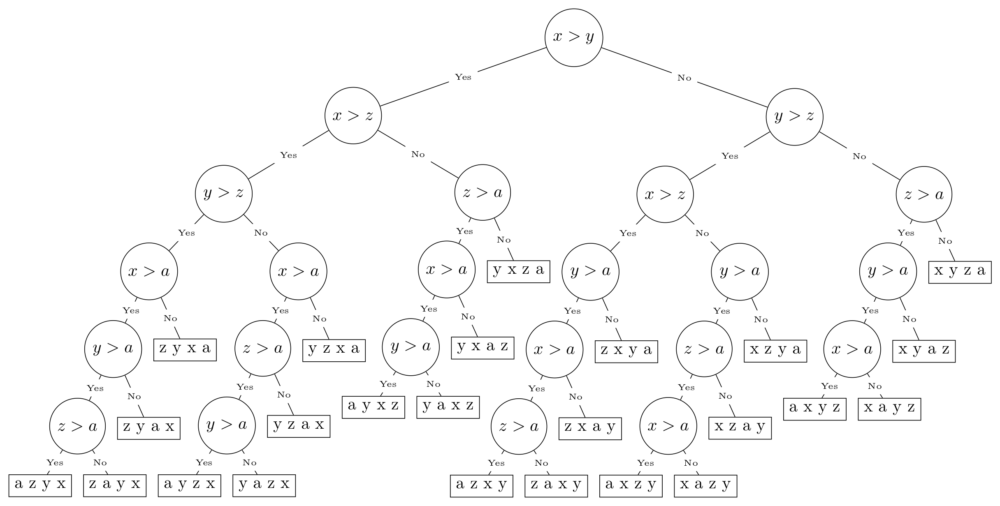

Decision-Tree-Generator
=======================

Program for generating decision tree LaTeX code for array-based
algorithms

Insertion Sort Decision Tree

Overview
--------

This project began with the idea of being able to generate a pruned,
valid decision tree for any simple algorithm that performs operations on
a small list of data. Above is an example of such a tree for the
Insertion Sort algorithm with the list of elements
``['x', 'y', 'z', 'a']``.

Usage
-----

When run on a particular algorithm, the program generates complete Latex
code to form a pruned, valid decision tree for that algorithm.

The main package provides a class ``TreeGenerator``, which should be
inherited with the ``algorithm()`` method overrided. In that method, an
algorithm should be entered that performs operations on the
``self.data`` list. Whenever a comparison of records is to be made in
your algorithm, substitute the comparison with the following method
call:

.. code:: python

   self.comp(<first record (self.data[x])>, <comparison operator ('<')>, <second record (self.data[y])>)

This method will return boolean values to control how the algorithm
operates.

To generate the decision tree, follow these steps: \* Create an instance
of your algorithm’s class. \* Run the ``execute()`` method on this
object. \* Run the ``render()`` method and save/print the outputted
Latex code.

From there, the Latex code can be placed into a ``.tex`` file and
compiled using a Latex processor.

Example
-------

Example algorithms and usage can be found in ``src/example.py``.

How it Works
------------

The main ``execute()`` method starts by initially calling the algorithm
implementation. Whenever a comparison is made, the program saves a
“state” of the program execution and adds a node to a tree structure for
printing the Latex code. It then returns ``True`` to cause the program
to make a left branch. With each comparison made, it checks to verify
the last comparison is valid and prunes the node if not. If the
comparison is not valid, it puts the algorithm in “lame duck” mode,
which instructs the comparison method to always return ``False``,
letting the algorithm run out its course. It continues this process
until the algorithm exits.

Once the algorithm exits, the program figures out what boolean values
the ``comp()`` function must return in order to restore the execution
state to the latest left (``True``) branch in the algorithm. It then
makes a right branch and continues the process all over again.

In this way, it explores all possible valid paths the algorithm could
take, given the input data and generates a tree structure to represent
it. From there, the ``render()`` method performs a pre-order traversal
of that tree, generating the Latex code as it goes.

Contribution
------------

If you have an addition you would like to make or find an issue, please
either open an issue or submit a pull request and I’ll try to handle it
as soon as possible.
